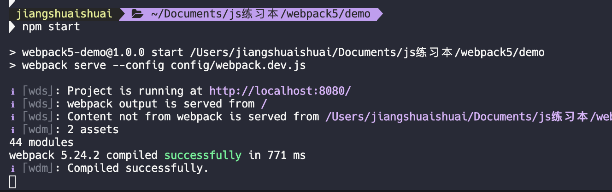
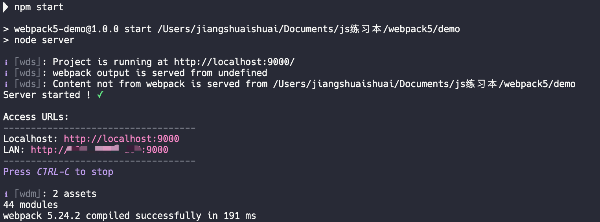
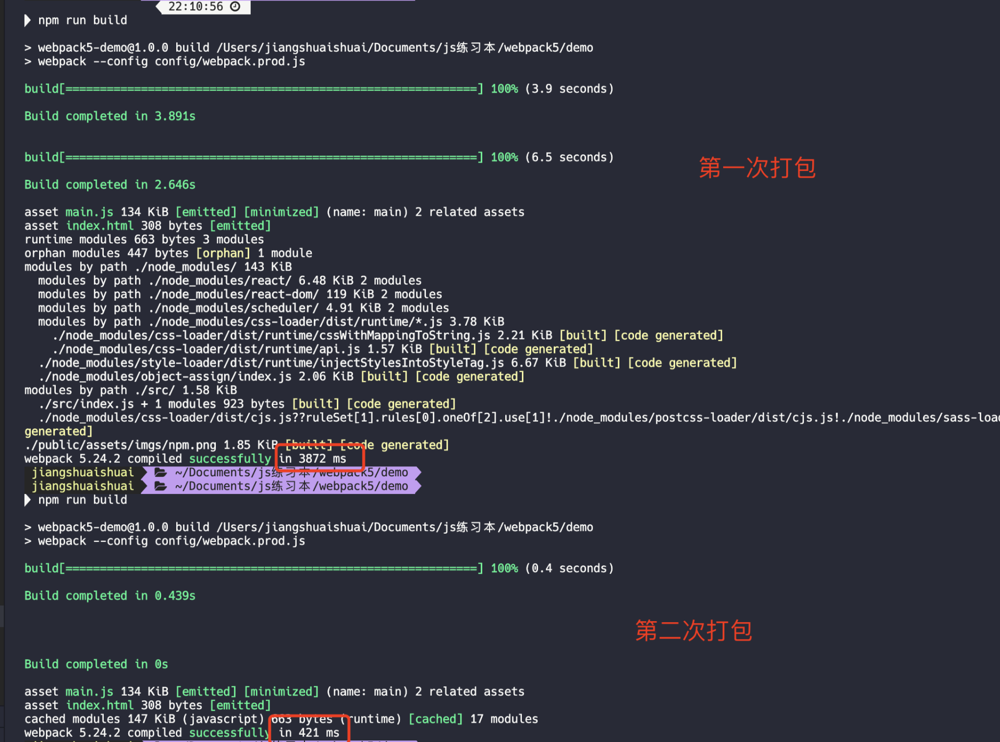

-   @Descripttion:
<!--
-   @Author: Jason

*   @LastEditTime: 2021-03-19 14:21:46
    -->

### Webpack5 搭建 react 脚手架（一）

`Webpack 5` 发布也有挺长时间了，现在在公司用的脚手架还是 v4 版的，听说 v5 版本更新的重点主要是针对构型性能的优化。听起来感觉挺香的，就想去用 `Webpack 5` 搭建一个架手架 看看整体感觉如何，因为我现在主要是用 `react` 开发 所以就以 `React` 为例搭建，对于 Webpack 5 不是很熟的朋友可以 看看这篇文章 [Webpack5 上手测评](https://juejin.cn/post/6844904169405415432),其实配置内容跟 Webpack 4 变化不大。主要还是性能上的提升，那么废话不多说，开始了。

> `Webpack 5` 对 Node.js 的版本要求至少是 10.13.0 (LTS)

#### 项目初始化

```bash
mkdir webpack5-demo
cd webpack5-demo
npm init -y
```

#### 安装基础的依赖文件

刚刚开始需要安转的包，我直接贴出来吧，可以复制到 package.json 文件上 执行 `npm i 或 yarn`

**package.json**

```json
"devDependencies": {
    "@babel/core": "^7.13.8",
    "@babel/preset-env": "^7.13.8",
    "@babel/preset-react": "^7.12.13",
    "babel-loader": "^8.2.2",
    "chalk": "^4.1.0",
    "clean-webpack-plugin": "^3.0.0",
    "css-loader": "^5.1.0",
    "html-webpack-plugin": "^5.2.0",
    "ip": "^1.1.5",
    "style-loader": "^2.0.0",
    "progress-bar-webpack-plugin": "^2.1.0",
    "speed-measure-webpack-plugin": "^1.4.2",
    "webpack": "^5.24.2",
    "webpack-cli": "^4.5.0",
    "webpack-dev-server": "^3.11.2"
  },
  "dependencies": {
    "react": "^17.0.1",
    "react-dom": "^17.0.1"
  }
```

**此时文件目录情况**

```js
webpack5-demo
├─ node_modules
├─ package-lock.json
└─ package.json
```

#### 配置 webpack

为了区分开发生产环境，方便维护，就不把所有内容配置到 `webpack.config.js` 这一个文件里面了。

```bash
# 这里我们新建一个 config 目录用来专门存放 webpack 配置文件
mkdir config
cd config
touch webpack.common.js # 开发环境 和 生产环境 公共配置 存放在这个文件里面
touch webpack.dev.js # 需要针对开发环境特殊处理的配置存放在这里
touch webpack.prod.js # 需要针对生产环境特殊处理的配置存放在这里
```

在配置 Webpack 的时候少不了会与 文件路径打交道，避免路径零乱，单独创建一个路径调用的配置文件，也是参考 CRA 的

```
touch paths.js
```

**paths.js**

```js
const path = require("path");
const fs = require("fs");
// 获取当前工作目录
const appDirectory = fs.realpathSync(process.cwd());
// 从相对路径中解析绝对路径
const resolveApp = (relativePath) => path.resolve(appDirectory, relativePath);
// 默认的模块扩展名
const moduleFileExtensions = ["js", "jsx", "ts", "tsx", "json"];
// 解析模块路径
const resolveModule = (resolveFn, filePath) => {
    // 查看文件存不存在
    const extension = moduleFileExtensions.find((extension) =>
        fs.existsSync(resolveFn(`${filePath}.${extension}`))
    );
    if (extension) {
        return resolveFn(`${filePath}.${extension}`);
    }
    return resolveFn(`${filePath}.js`); // 如果没有默认就是js
};

module.exports = {
    appBuild: resolveApp("build"), // 打包路径
    appPublic: resolveApp("public"), // 静态资源路径
    appHtml: resolveApp("public/index.html"), // html 模板路径
    appIndexJs: resolveModule(resolveApp, "src/index"), // 打包入口路径
    appNodeModules: resolveApp("node_modules"), // node_modules 路径
    appSrc: resolveApp("src"), // 主文件入口路径
    moduleFileExtensions, // 模块扩展名
};
```

**此时文件目录情况**

```js
demo
├─ config
├─ paths.js
│  ├─ webpack.common.js
│  ├─ webpack.dev.js
│  └─ webpack.prod.js
├─ node_modules
├─ package-lock.json
└─ package.json
```

**webpack.common.js**

```js
const paths = require("./paths");
const HtmlWebpackPlugin = require("html-webpack-plugin");
module.exports = function (options) {
    return {
        mode: options.mode,
        entry: paths.appSrc,
        output: {
            path: paths.appBuild,
            publicPath: "/",
        },
        cache: {
            // 使用持久化缓存
            type: "filesystem", //memory:使用内容缓存 filesystem：使用文件缓存
        },
        devtool: false,
        module: {
            rules: [
                {
                    test: /\.js$/,
                    exclude: /node_modules/,
                    use: [
                        {
                            loader: "babel-loader",
                            options: {
                                presets: [
                                    "@babel/preset-env",
                                    "@babel/preset-react",
                                ],
                            },
                        },
                    ],
                },
            ],
        },
        devServer: {},
        plugins: [
            new HtmlWebpackPlugin({
                template: "./public/index.html",
            }),
            ...options.plugins,
        ],
        stats: options.stats, // 打包日志发生错误和新的编译时输出
    };
};
```

entry 是 入口，这里我们需要新建一个入口文件

```bash
# 回到webpack5-demo 根目录
# 创建一个src 目录开发文件

mkdir src
touch index.js # 创建一个入口文件
```

```js
import React from "react";
import ReactDOM from "react-dom";

const App = () => {
    return <div> App入口 </div>;
};

ReactDOM.render(<App />, document.querySelector("#root"));
```

在打包的时候，使用了`HtmlWebpackPlugin`,所以得去创建一个 html 模板提供足够插件使用

```bash
# 回到webpack5-demo 根目录
# 创建一个public 目录专门存放 静态资源

mkdir public
touch index.html # 创建一个html 模板
```

**index.html**

```js
<!DOCTYPE html>
<html lang="en">
    <head>
        <meta charset="UTF-8" />
        <meta http-equiv="X-UA-Compatible" content="IE=edge" />
        <meta name="viewport" content="width=device-width, initial-scale=1.0" />
        <title>Webpack-React-Cli</title>
    </head>
    <body>
        <div id="root"></div>
    </body>
</html>
```

**webpack.dev.js**

```js
module.exports = require("./webpack.common")({
    mode: "development",
    plugins: [],
    stats: "errors-only", //只在发生错误或有新的编译时输出
});
```

**webpack.prod.js**

```js
const { CleanWebpackPlugin } = require("clean-webpack-plugin"); //打包前清空build目录文件
const ProgressBarPlugin = require("progress-bar-webpack-plugin"); // 打包进度条美化
const chalk = require("chalk");

module.exports = require("./webpack.common")({
    mode: "production",
    devtool: "source-map",
    plugins: [
        new CleanWebpackPlugin(),
        new ProgressBarPlugin({
            format:
                `${chalk.green.bold("build[:bar]")} ` +
                chalk.green.bold(":percent") +
                " (:elapsed seconds)",
            clear: false,
            width: 60,
        }),
    ],
    stats: "normal", //标准输出
});
```

**此时文件目录情况**

```js
webpack5-demo
├─ config
│  ├─ paths.js
│  ├─ webpack.common.js
│  ├─ webpack.dev.js
│  └─ webpack.prod.js
├─ node_modules
├─ public
│  └─ index.html
├─ src
│  └─ index.js
├─ package-lock.json
└─ package.json
```

#### 启动服务

现在我们的 webpack 基础配置已经 OK 了，就差启动了

配置 pageage.json 脚本

```js
{
  "name": "webpack5-demo",
  "version": "1.0.0",
  "description": "基于webpack5 的React架手架",
  "main": "index.js",
  "scripts": {
    "build": "webpack --config config/webpack.prod.js",
    "start": "webpack serve --config config/webpack.dev.js", // v5
    "dev": "webpack-dev-server --config config/webpack.dev.js" //v4
  },
  "keywords": [],
  "author": "Jason",
  "license": "ISC",
  ...
}
```

这里有点小改动：

在 `Webpack 4` 里面通过 `webpack-dev-server`起服务
在 `Webpack 5` 里面启动服务里通过 `webpack serve`



现在已经成功启动了，但是这个启动日志不是很喜欢，我得改造一下（实现自定义输出编译内容），需要重新配置一下开发服务器（webpack-dev-server）

#### 配置开发服务器

虽然建议通过 CLI 运行 webpack-dev-server，但我们也可以选择通过 API 启动服务器。

```bash
# 回到webpack5-demo 根目录
# 创建一个server目录

mkdir server
touch index.js # 服务入口
touch appConfig.js # 基础服务配置 自定义服务端口，ip, 代理地址
touch logger.js # 控制台输出的日志
```

**appConfig.js**

```js
module.exports = {
    deployUrl: "127.0.0.0:8080", // 本地代码推推送到指定服务器
    proxyUrlMap: {
        "/api": "localtion:3000", // 代理的接口
        "/api2": "localtion:4000", // 代理的接口
    },
    port: 9000, //端口号,
    host: "localhost", //主机号
};
```

**logger.js**

```js
const ip = require("ip");

const divider = chalk.gray("\n-----------------------------------");

const logger = {
    error: (err) => {
        console.error(chalk.red(err));
    },
    appStarted: (port, host, tunnelStarted) => {
        console.log(`Server started ! ${chalk.green("✓")}`);

        if (tunnelStarted) {
            console.log(`Tunnel initialised ${chalk.green("✓")}`);
        }
        console.log(`
${chalk.bold("Access URLs:")}${divider}
Localhost: ${chalk.magenta(`http://${host}:${port}`)}
LAN: ${
            chalk.magenta(`http://${ip.address()}:${port}`) +
            (tunnelStarted
                ? `\n    Proxy: ${chalk.magenta(tunnelStarted)}`
                : "")
        }${divider}
${chalk.blue(`Press ${chalk.italic("CTRL-C")} to stop`)}
    `);
    },
};

module.exports = logger;
```

**index.js**

```js
const Webpack = require("webpack");
const WebpackDevServer = require("webpack-dev-server");
// webpack开发 配置文件
const webpackConfig = require("../config/webpack.dev");
// 自定义日志输出
const logger = require("./logger");
// 服务配置
const appConfig = require("./appConfig");

const { port, host } = appConfig; // 监听的端口号
//编译器
const compiler = Webpack(webpackConfig);
//  devServer 参数
const devServerOptions = Object.assign({}, webpackConfig.devServer, {
    // open: true, // 自动打开浏览器
    compress: true, // gzip 压缩
    stats: "minimal",
});
const server = new WebpackDevServer(compiler, devServerOptions);

server.listen(port, host, async (err) => {
    if (err) {
        return logger.error(err.message);
    }
    logger.appStarted(port, "localhost");
});
```

在`package.json` 配置启动命令

```js
"scripts": {
    "build": "webpack --config config/webpack.prod.js",
    "start": "node server"
  },
```



**此时文件目录情况**

```js
webpack5-demo
├─ config
│  ├─ paths.js
│  ├─ webpack.common.js
│  ├─ webpack.dev.js
│  └─ webpack.prod.js
├─ node_modules
├─ public
│  └─ index.html
├─ server
│  ├─ appConfig.js
│  ├─ index.js
│  └─ logger.js
├─ src
│  └─ index.js
├─ package-lock.json
└─ package.json
```

#### resolve 解析

`resolve` 配置以下这几个就可以了，其他使用默认就行

-   modules: 使用第三模块 第一反应去 根目录下的 node_modules 寻找
-   extensions : 在 `import` 的时候不加文件扩展名,会依次遍历`extensions` 添加扩展名进行匹配
-   alias: 创建别名， 在`import` 或 `require` 的别名，来确保模块引入变得更简单

```js
 resolve: {
    modules: [paths.appNodeModules],
    extensions: ['.js', '.jsx', '.css'],
    alias: {
        moment$: 'moment/moment.js',
        '@src': paths.appSrc,
        '@public': paths.appPublic,
    },
},
```

#### 基础 loader 配置

##### css 和 sass

**安装**

```bash
npm i -D style-loader css-loader
npm i -D node-sass sass-loader postcss postcss-loader postcss-preset-env
```

css 和 sass 的 loader 配置很简单
考虑到兼容性问题，还需要 postcss-loader 添加浏览器厂家标识头

用到的插件单独放在根目录的 `postcss.config.js` 配置文件里头

**postcss.config.js**

```js
module.exports = {
    plugins: {
        "postcss-preset-env": {},
    },
};
```

##### 模块资源

`Webpack 4` 在处理图片或文本类文件的时候用的都是 `file-loader` 或者 `url-loader`
现在对于 `Webpack 5` 来说可以用 `Asset Modules` (资源模块)，就不需要配置 loader 了

-   asset/source 导出资源的源代码 （相当于 raw-loader）
-   asset/resource 发送一个单独的文件并导出 URL（相当于 file-loader）
-   asset/inline 导出一个资源的 data URI（相当于 url-loader）
-   asset 在导出一个 data URI 和发送一个单独的文件之间自动选择，之前通过使用 url-loader，并且配置资源体积限制实现

```js
// 设置 常量
const cssRegex = /\.css$/;
const cssModuleRegex = /\.module\.css$/;
const sassRegex = /\.(scss|sass)$/;
const sassModuleRegex = /\.module\.(scss|sass)$/;
const imageInlineSizeLimit = 4 * 1024;

module.exports = function (options) {

    return {

        ...

        module: {
            rules: [
                {
                    oneOf: [

                        ...

                        {
                            test: cssRegex,
                            exclude: cssModuleRegex,
                            use: ['style-loader', {
                                loader: 'css-loader',
                                options: {
                                    importLoaders: 1 // 0 => 无 loader(默认); 1 => postcss-loader; 2 => postcss-loader, sass-loader
                                }
                            },'postcss-loader'],
                        },
                        {
                            test: sassRegex,
                            exclude: sassModuleRegex,
                            use: ['style-loader', {
                                loader: 'css-loader',
                                options: {
                                    importLoaders: 1 // 查询参数 importLoaders，用于配置「css-loader 作用于 @import 的资源之前」有多少个 loader
                                }
                            }, 'postcss-loader', 'sass-loader'],
                        },
                        {
                            test: [/\.bmp$/, /\.gif$/, /\.jpe?g$/, /\.png$/],
                            type: 'asset',
                            parser: {
                                dataUrlCondition: {
                                    maxSize: imageInlineSizeLimit // 4kb
                                }
                            }
                        },
                        {
                            test: /\.(eot|svg|ttf|woff|woff2?)$/,
                            type: 'asset/resource'
                        },
                    ]
                }

            ]
        },
    }

```

**测试一下 css 和图片**

```bash
# 在src 目录下新一个 style.scss 文件

touch style.scss
```

先写入点内容

```css
* {
    margin: 0;
    padding: 0;
}

div {
    color: red;
}
```

引入样式和图片

```js
import React from "react";
import ReactDOM from "react-dom";

import npm from "@public/assets/imgs/npm.png";

import "./style.scss";

const App = () => {
    return (
        <div>
            App入口
            
        </div>
    );
};

ReactDOM.render(<App />, document.querySelector("#root"));
```


**再看看打包情况**


由于设置了持久化缓存，第二次速度就很快
**此时文件目录情况**

```js
webpack5-demo
├─ build
├─ config
│  ├─ paths.js
│  ├─ webpack.common.js
│  ├─ webpack.dev.js
│  └─ webpack.prod.js
├─ node_modules
├─ public
│  ├─ assets
│  │  └─ imgs
│  │     └─ npm.png
│  └─ index.html
├─ server
│  ├─ appConfig.js
│  ├─ index.js
│  └─ logger.js
├─ src
│  ├─ index.js
│  └─ style.css
├─ package-lock.json
└─ package.json
```

### 小结

内容还是比较多的打算分两篇来写，第一篇还是写的比较简单。 第二篇更多的是优化的，针对 webpack 5 新特性来优化、代码规范配置 eslint、一些插件的使用, 也是也想尝试写写文章，看看第一稿怎么样吧，超过 50 赞写下一篇 （哈哈哈 O(∩_∩)O）

### 第二篇

这是 webpack5 配置 React 开发环境 的后续，由于上一篇主要拿来试水讲的可能比较浅，细节考虑的不是很到位，那么通过这篇来完善一下吧，最近也是忙着搞埋点，我也不想 咕咕咕 （放鸽子），所以抽点时间写一下。
好的 那么 开始进入正题，现附上上一篇的文章的 [传送门](https://juejin.cn/post/6844904169405415432)大家可以回顾一下 以及[源码](https://github.com/jshuaishuai/react-cli-firstEdit)

## 开发配置完善

### Babel 转译器和插件

首先先完善一下之前 `loader` 的配置

下面是原先的 处理`js、jsx `的 `loader`配置

```js
{
    test: /\.(js|jsx)$/,
    exclude: /node_modules/,
    use: [
        {
            loader: "babel-loader",
            options: {
                presets: [
                    "@babel/preset-env",
                    "@babel/preset-react",
                ],
            },
        },
    ],
},
```

#### Babel presets 配置

babel 应该有知道吧 `是一个 JavaScript 编译器` 官方的定义，它的作用的是让低版本浏览器使用 ES 上新的语法和新的数据类型, 将高版本的 ES 语法和 API 转换成现有浏览器可以运行的代码, 起转译作用。

```js
babel-loader @babel/core @babel/preset-env
```

这个三个算的上 babel 在 webpack 中的必不可少的存在

##### babel-loader

这个包允许使用 Babel 和 webpack 编译 JavaScript 文件 [babel-loader](https://github.com/babel/babel-loader/blob/master/README.md)

##### @babel/core

它是 babel 核心库，提供了很多转译 源文件的 API，它需要插件 才能转译，本身不会转译，

```js
import { transformSync } from "@babel/core";

function babelLoader(source, options) {
    //  var options= {
    //             presets: [
    //                 "@babel/preset-env",
    //                 "@babel/preset-react",
    //             ],
    //         },
    var result = transformSync(source, options);
    return this.callback(null, result.code, result.map, result.ast);
}
module.exports = babelLoader;
```

-   source 需要的转译源文件或者是上一个 loader 转译过的结果
-   options 就是配置 loader 中传的 options 参数
-   transformSync 同步转译传入的代码，返回转转译后代码、sourceMap 映射和 AST 对象。

##### @babel/preset-env

`babel/preset-env` 是语法转译器也可以叫预设，但是它只转换新的 ES 语法，而不转换新的 ES API，比如 Iterator, Generator, Set, Maps, Proxy, Reflect,Symbol,Promise，而对与这些 新的 API 可以通过 babel-profill 转译，让浏览器实现 新 API 的功能 但是 [babek-profill](https://github.com/babel/babel/tree/master/packages/babel-polyfill) 已经不建议使用了,建议使用 core-js

> As of Babel 7.4.0, this package has been deprecated in favor of directly including core-js/stable (to polyfill ECMAScript features) and regenerator-runtime/runtime (needed to use transpiled generator functions):

```js
npm i core-js -S
```

配置如下

```js
{
    test: /\.(js|jsx)$/,
    exclude: /node_modules/,
    use: [
        {
            loader: 'babel-loader',
            options: {
                presets: [['@babel/preset-env', {
                    useBuiltIns: 'entry',
                    corejs: '3.9.1',
                    targets: {
                        chrome: '60',
                    },
                }], '@babel/preset-react'],
            },
        },
    ],
},
```

##### @babel/preset-env 参数

-   useBuiltIns: "usage"| "entry"| false，默认为 false, 这里讲一讲 `usage` 其他参数的具体看官方描述[传送门](https://www.babeljs.cn/docs/babel-preset-env)

-   usage 会根据配置的浏览器兼容，和只对你用到的 API 来进行 polyfill，实现按需添加补丁

-   targets：

```js
// 对市场份额 >0.25% 做兼容
{
  "targets": "> 0.25%, not dead"
}
// 对要支持的最低环境版本的对象 做兼容
{
  "targets": {
    "chrome": "58",
    "ie": "11"
  }
}
```

当未指定目标时，它的行为类似：preset-env 将所有 ES2015-ES2020 代码转换为与 ES5 兼容。不建议直接使用以下 preset-env 这种方式，因为它没有利用针对特定环境/版本的功能

```js
{
  "presets": ["@babel/preset-env"]
}
```

由于自@babel/polyfill7.4.0 起已弃用，因此建议您 core-js 通过该 corejs 选项直接添加和设置版本

-   corejs: '3.9.1' 这个'3.9.1' 是 core-js 版本号

#### @babel/preset-react

React 插件的 Babel 预设, `JSX` 转 `React.createElement()`来调用的，主要在转译 react 代码的时候使用。

-   这是一段 jsx 代码

```js
<div className="wrap" style={{ color: "#272822" }}>
    <span>一起学习</span>React
</div>
```

-   经过 babel/preset-react 转移器转译成：

```js
React.createElement(
    "div",
    {
        className: "wrap",
        style: {
            color: "#272822",
        },
    },
    React.createElement("span", null, "一起学习"),
    "React"
);
```

#### babel plugin 配置

@babel/plugin-syntax-dynamic-import 支持动态加载 import,@babel/preset-env 不支持动态 import 语法转译。

> Currently, @babel/preset-env is unaware that using import() with Webpack relies on Promise internally. Environments which do not have builtin support for Promise, like Internet Explorer, will require both the promise and iterator polyfills be added manually.

@babel/plugin-proposal-decorators 把类和对象的装饰器编译成 ES5 代码
@babel/plugin-proposal-class-properties 转换静态类属性以及使用属性初始值化语法声明的属性

> 配置转译所需要的插件。使用插件的顺序是按照插件在数组中的顺序依次调用的

现在 babel-loader 参数比较臃肿可以提到 .babelrc.js 文件中

```js
module.exports = {
    presets: [
        [
            "@babel/preset-env",
            {
                useBuiltIns: "entry",
                corejs: "3.9.1",
                targets: {
                    chrome: "58",
                    ie: "11",
                },
            },
        ],
        [
            "@babel/preset-react",
            {
                development: process.env.NODE_ENV === "development",
            },
        ],
    ],
    plugins: [
        ["@babel/plugin-proposal-decorators", { legacy: true }],
        ["@babel/plugin-proposal-class-properties", { loose: true }],
        "@babel/plugin-syntax-dynamic-import",
    ],
};
```

### eslint 配置

目前 eslist 推荐使用 [eslint-webpack-plugin](https://webpack.js.org/plugins/eslint-webpack-plugin/) eslint-loader 即将废弃

> The loader eslint-loader will be deprecated soon

```bash
npm i
eslint
eslint-webpack-plugin
eslint-config-airbnb-base
eslint-plugin-import -D
```

-   eslint >= 7 (版本)

-   eslint-config-airbnb-base 支持所有 es6+的语法规范,需要 eslint 和 eslint-plugin-import 一起使用

-   eslint-plugin-import 用于支持 eslint-config-airbnb-base 做导入/导出语法的检查

**webpack.dev.js**

```js
 new ESLintPlugin({
                fix: true, // 启用ESLint自动修复功能
                extensions: ['js', 'jsx'],
                context: paths.appSrc, // 文件根目录
                exclude: '/node_modules/',// 指定要排除的文件/目录
                cache: true, //缓存
            }),
```

此外有了 ES 的语法规范 还需要 react jsx 的的语法规法，

```js
npm i eslint-plugin-react -D
// 在eslint config 拓展预设中 配置 react
extends: [
    "plugin:react/recommended", // jsx 规范支持
    "airbnb-base", // 包含所欲ES6+ 规范
],

// 或者 在插件中设置

"plugins": [
    "react"
  ]
```

同时在根目录配置 `.eslintrc.js`文件

```js
module.exports = {
    env: {
        browser: true,
        es2021: true,
    },
    extends: [
        "plugin:react/recommended", // jsx 规范支持
        "airbnb-base", // 包含所欲ES6+ 规范
    ],
    parserOptions: {
        ecmaFeatures: {
            jsx: true, // Enable JSX support. With ESLint 2+
        },
        ecmaVersion: 12,
        sourceType: "module",
    },
    plugins: ["react"],
    rules: {
        indent: ["error", 4], // 控制缩进为4空格
        "no-console": "off", // 出现console 不报错
        "consistent-return": "off", // 箭头函数不强制return
        "import/no-extraneous-dependencies": "off",
        semi: "error",
        "react/jsx-indent": "off",
        "import/no-unresolved": [
            0,
            {
                ignore: ["^@/"], // @ 是设置的路径别名
            },
        ],
        "no-debugger": process.env.NODE_ENV === "production" ? "error" : "off",
    },
};
/*
"off"或者0    //关闭规则
"warn"或者1    //在打开的规则作为警告（不影响退出代码）
"error"或者2    //把规则作为一个错误（退出代码触发时为1）
*/
```

也可以把 eslint 配置 放在 package.json，跟下面这样但是内容有点多 为了减少耦合性还是放根目录吧
**package.json**

```json
"eslintConfig": {
    "extends": ["plugin:react/recommended","airbnb-base"],
    "parserOptions": {
        "ecmaFeatures": {
            "jsx": true
        },
        "ecmaVersion": 12,
        "sourceType": "module"
    },
    "plugins": [
        "react"
    ],
    "rules": {
        "indent": ["error", 4],
        "consistent-return": "off",
        "import/no-extraneous-dependencies": "off",
        "semi": "error",
        "react/jsx-indent": "off"
    },
    "settings": {
      "import/resolver": [
        "node",
        {
            "webpack": {
              "config": "./config/webpack.common.js"
            }

        }
    ]
    }
  }

```

### 生成环境配置完善

#### 抽离 css

npm install --save-dev mini-css-extract-plugin

#### 压缩 css

npm install css-minimizer-webpack-plugin --save-dev

Optimize CSS Assets Webpack Plugin 不推荐使用了

> ⚠️ For webpack v5 or above please use css-minimizer-webpack-plugin instead.

#### 压缩 js

-   如果您使用的是 webpack v5 或更高版本，则无需安装此插件。Webpack v5 随附了最新 terser-webpack-plugin 的包装

#### 压缩图片

因为 CSS 的下载和 JS 可以并行,当一个 HTML 文件很大的时候，我们可以把 CSS 单独提取出来加载

@babel/plugin-proposal-decorators 把类和对象装饰器编译成 ES5
@babel/plugin-proposal-class-properties 转换静态类属性以及使用属性初始值化语法声明的属性

````

### 基础 plugin 配置

DefinePlugin 设置环境变量

-   可以在任意模块内通过 NODE_ENV 获取当前的环境变量
-   只能在模块中获取

```js
new webpack.DefinePlugin({
    'NODE_ENV': isEnvProduction && JSON.stringify('production'), // 设置全局
}),
````

IgnorePlugin

-   gnorePlugin 用于忽略某些特定的模块，让 webpack 不把这些指定的模块打包进去

import moment from 'moment';
console.log(moment);
new webpack.IgnorePlugin(/^\.\/locale/,/moment$/)

index.js
ww

```js
console.log(NODE_ENV); //  production
```

### 缩小文件查找范围
